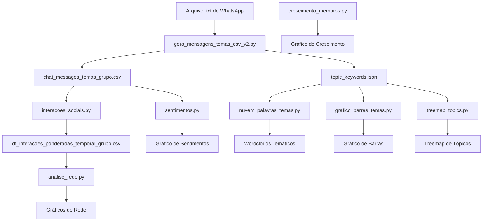

# Documentação do Fluxo de Análise de Dados do Grupo

## Visão Geral do Processamento


## 1. Pré-processamento de Dados
**Scripts principais:**
- `gera_mensagens_temas_csv_v2.py`  
  _Entrada:_ `Conversa do WhatsApp...txt` + `topic_keywords.json`  
  _Saída:_ `chat_messages_temas_grupo.csv` (mensagens classificadas por tópico)

## 2. Análise Central
**Módulos:**
- `interacoes_sociais.py`  
  _Entrada:_ Chat original (.txt)  
  _Saída:_ `df_interacoes_ponderadas_temporal_grupo.csv` (interações temporais)

- `sentimentos.py`  
  _Entrada:_ `chat_messages_temas_grupo.csv`  
  _Saída:_ Gráfico de pizza de sentimentos

## 3. Visualizações
**Scripts de geração de gráficos:**
- `analise_rede.py` → Network graphs  
- `nuvem_palavras_temas.py` → Wordclouds temáticos  
- `grafico_barras_temas.py` → Distribuição de tópicos  
- `treemap_topics.py` → Hierarquia de tópicos  
- `crescimento_membros.py` → Evolução de membros

## Ordem Recomendada de Execução
1. Atualizar `topic_keywords.json` (se necessário)
2. Rodar `gera_mensagens_temas_csv_v2.py`
3. Executar análise de sentimentos e interações:
   ```bash
   python sentimentos.py
   python interacoes_sociais.py
   ```
4. Gerar visualizações:
   ```bash
   python analise_rede.py
   python nuvem_palavras_temas.py
   python grafico_barras_temas.py
   python treemap_topics.py
   python crescimento_membros.py
   ```

## Dependências Críticas
- Todos scripts requerem Python 3.8+
- Bibliotecas essenciais: pandas, matplotlib, seaborn, wordcloud
- `topic_keywords.json` deve manter estrutura hierárquica
